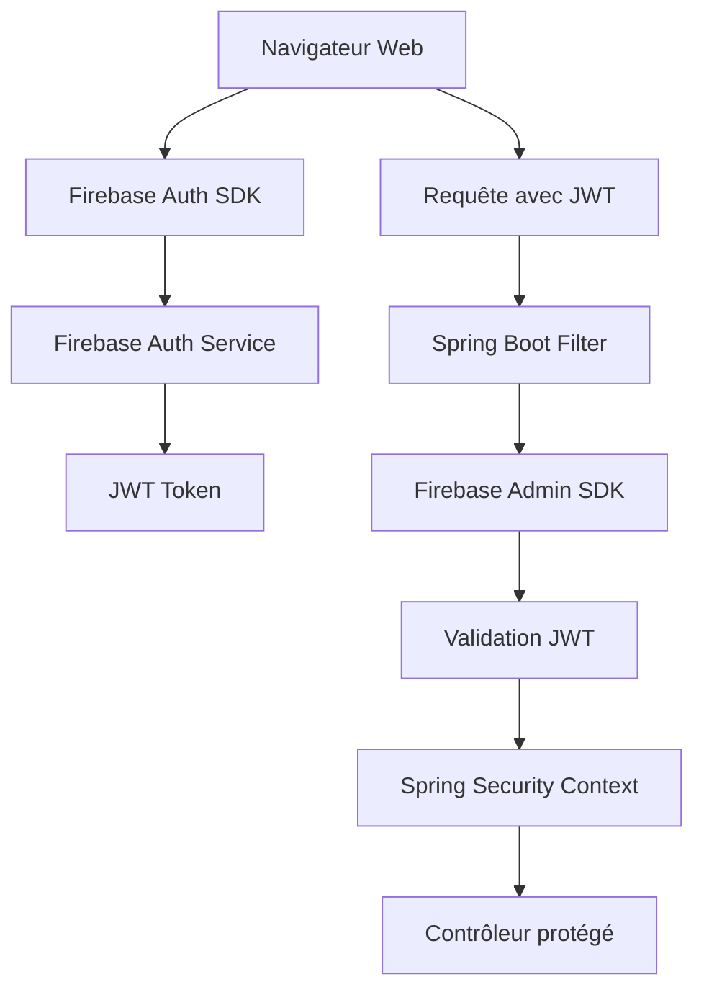

# Résolution des problèmes d'authentification

## 🎯 Objectif

Corriger les erreurs d'authentification dans l'application Spring Boot BeeTrack avec Firebase Admin SDK.

## 🐛 Problèmes identifiés

### 1. Configuration Firebase Admin SDK
- **Erreur** : Service account non configuré
- **Impact** : Impossibilité d'authentifier les utilisateurs

### 2. Spring Security
- **Erreur** : Configuration incorrecte pour Firebase JWT
- **Impact** : Rejet des requêtes authentifiées

### 3. Headers manquants
- **Erreur** : Headers d'authentification non transmis
- **Impact** : Erreurs 401 Unauthorized

## ✅ Solution implémentée

### Configuration Spring Security

```java
@Configuration
@EnableWebSecurity
public class SecurityConfig {
    
    @Autowired
    private FirebaseAuthFilter firebaseAuthFilter;
    
    @Bean
    public SecurityFilterChain filterChain(HttpSecurity http) throws Exception {
        http
            .csrf(csrf -> csrf.disable())
            .sessionManagement(session -> 
                session.sessionCreationPolicy(SessionCreationPolicy.STATELESS))
            .authorizeHttpRequests(auth -> auth
                .requestMatchers("/api/auth/**").permitAll()
                .requestMatchers("/dev/**").permitAll()
                .requestMatchers("/actuator/**").permitAll()
                .anyRequest().authenticated()
            )
            .addFilterBefore(firebaseAuthFilter, UsernamePasswordAuthenticationFilter.class);
            
        return http.build();
    }
}
```

### Filtre d'authentification Firebase

```java
@Component
public class FirebaseAuthFilter extends OncePerRequestFilter {
    
    @Autowired
    private FirebaseAuth firebaseAuth;
    
    @Override
    protected void doFilterInternal(HttpServletRequest request, 
                                  HttpServletResponse response, 
                                  FilterChain filterChain) throws ServletException, IOException {
        
        String token = extractToken(request);
        
        if (token != null) {
            try {
                FirebaseToken decodedToken = firebaseAuth.verifyIdToken(token);
                String uid = decodedToken.getUid();
                
                // Créer l'authentification Spring Security
                UsernamePasswordAuthenticationToken auth = 
                    new UsernamePasswordAuthenticationToken(uid, null, Collections.emptyList());
                    
                SecurityContextHolder.getContext().setAuthentication(auth);
                
            } catch (FirebaseAuthException e) {
                response.setStatus(HttpServletResponse.SC_UNAUTHORIZED);
                response.getWriter().write("Token Firebase invalide");
                return;
            }
        }
        
        filterChain.doFilter(request, response);
    }
    
    private String extractToken(HttpServletRequest request) {
        String authHeader = request.getHeader("Authorization");
        if (authHeader != null && authHeader.startsWith("Bearer ")) {
            return authHeader.substring(7);
        }
        return null;
    }
}
```

## 🔧 Configuration Firebase

### Service Account

```properties
# application.properties
firebase.project-id=ruche-connectee-93eab
firebase.service-account-key=firebase-service-account.json
```

### Bean Firebase Auth

```java
@Configuration
public class FirebaseConfig {
    
    @Value("${firebase.service-account-key}")
    private String serviceAccountPath;
    
    @Bean
    public FirebaseApp firebaseApp() throws IOException {
        if (FirebaseApp.getApps().isEmpty()) {
            ClassPathResource resource = new ClassPathResource(serviceAccountPath);
            
            FirebaseOptions options = FirebaseOptions.builder()
                .setCredentials(GoogleCredentials.fromStream(resource.getInputStream()))
                .build();
                
            return FirebaseApp.initializeApp(options);
        }
        return FirebaseApp.getInstance();
    }
    
    @Bean
    public FirebaseAuth firebaseAuth() {
        return FirebaseAuth.getInstance();
    }
}
```

## 🌐 Côté Frontend Web

### Thymeleaf avec Firebase Auth

```html
<!-- layout.html -->
<script src="https://www.gstatic.com/firebasejs/9.0.0/firebase-app.js"></script>
<script src="https://www.gstatic.com/firebasejs/9.0.0/firebase-auth.js"></script>

<script>
// Configuration Firebase
const firebaseConfig = {
    apiKey: "[[${@environment.getProperty('firebase.api-key')}]]",
    authDomain: "ruche-connectee-93eab.firebaseapp.com",
    projectId: "ruche-connectee-93eab"
};

firebase.initializeApp(firebaseConfig);

// Gestion de l'authentification
firebase.auth().onAuthStateChanged(function(user) {
    if (user) {
        // Récupérer le token JWT
        user.getIdToken().then(function(token) {
            // Stocker le token pour les requêtes AJAX
            sessionStorage.setItem('firebaseToken', token);
            
            // Mettre à jour l'interface
            updateUIForLoggedInUser(user);
        });
    } else {
        // Rediriger vers la page de connexion
        window.location.href = '/login';
    }
});

// Fonction pour faire des requêtes authentifiées
function authenticatedFetch(url, options = {}) {
    const token = sessionStorage.getItem('firebaseToken');
    
    if (!options.headers) {
        options.headers = {};
    }
    
    if (token) {
        options.headers['Authorization'] = 'Bearer ' + token;
    }
    
    return fetch(url, options);
}
</script>
```

### Page de connexion

```html
<!-- login.html -->
<div class="login-container">
    <form id="loginForm">
        <div class="form-group">
            <label for="email">Email</label>
            <input type="email" id="email" required>
        </div>
        
        <div class="form-group">
            <label for="password">Mot de passe</label>
            <input type="password" id="password" required>
        </div>
        
        <button type="submit">Se connecter</button>
    </form>
</div>

<script>
document.getElementById('loginForm').addEventListener('submit', function(e) {
    e.preventDefault();
    
    const email = document.getElementById('email').value;
    const password = document.getElementById('password').value;
    
    firebase.auth().signInWithEmailAndPassword(email, password)
        .then(function(userCredential) {
            // Connexion réussie
            window.location.href = '/dashboard';
        })
        .catch(function(error) {
            console.error('Erreur de connexion:', error);
            alert('Erreur de connexion: ' + error.message);
        });
});
</script>
```

## 🔒 Architecture d'authentification



### Flux d'authentification

1. **Connexion utilisateur** : Identifiants → Firebase Auth
2. **Récupération JWT** : Firebase renvoie un token JWT
3. **Stockage token** : Token stocké en session storage
4. **Requêtes authentifiées** : Header `Authorization: Bearer <token>`
5. **Validation côté serveur** : Firebase Admin SDK vérifie le token
6. **Contexte Spring** : Utilisateur authentifié dans Spring Security

## 🧪 Tests d'authentification

### Contrôleur de test

```java
@RestController
@RequestMapping("/api/test")
public class AuthTestController {
    
    @GetMapping("/profile")
    public ResponseEntity<Map<String, Object>> getProfile(Authentication auth) {
        if (auth == null) {
            return ResponseEntity.status(401).body(Map.of("error", "Non authentifié"));
        }
        
        String uid = (String) auth.getPrincipal();
        
        return ResponseEntity.ok(Map.of(
            "uid", uid,
            "authenticated", true,
            "timestamp", System.currentTimeMillis()
        ));
    }
    
    @GetMapping("/protected")
    @PreAuthorize("hasRole('USER')")
    public ResponseEntity<String> protectedEndpoint() {
        return ResponseEntity.ok("Accès autorisé");
    }
}
```

### Test côté frontend

```javascript
// Test de l'authentification
function testAuth() {
    authenticatedFetch('/api/test/profile')
        .then(response => response.json())
        .then(data => {
            if (data.authenticated) {
                console.log('✅ Authentification OK:', data);
            } else {
                console.log('❌ Authentification échouée:', data);
            }
        })
        .catch(error => {
            console.error('❌ Erreur test auth:', error);
        });
}
```

## 🐛 Résolution des problèmes

### Erreur 401 - Unauthorized

#### Causes possibles :
1. Token JWT expiré
2. Token mal formaté
3. Configuration Firebase incorrecte
4. Service account manquant

#### Solutions :
```java
// Vérifier la configuration
@RestController
public class DiagnosticController {
    
    @GetMapping("/diagnostic/auth")
    public ResponseEntity<Map<String, Object>> diagnostic(HttpServletRequest request) {
        Map<String, Object> diagnostic = new HashMap<>();
        
        // Vérifier les headers
        String authHeader = request.getHeader("Authorization");
        diagnostic.put("authHeader", authHeader != null ? "Présent" : "Absent");
        
        // Vérifier Firebase
        try {
            FirebaseApp app = FirebaseApp.getInstance();
            diagnostic.put("firebaseApp", "Configuré");
        } catch (Exception e) {
            diagnostic.put("firebaseApp", "Erreur: " + e.getMessage());
        }
        
        return ResponseEntity.ok(diagnostic);
    }
}
```

### Erreur Token invalide

#### Vérifications :
1. **Expiration** : Les tokens Firebase expirent après 1h
2. **Format** : Doit commencer par `Bearer `
3. **Audience** : Doit correspondre au project ID

#### Solution :
```javascript
// Renouvellement automatique du token
setInterval(function() {
    const user = firebase.auth().currentUser;
    if (user) {
        user.getIdToken(true).then(function(token) {
            sessionStorage.setItem('firebaseToken', token);
        });
    }
}, 50 * 60 * 1000); // Renouveler toutes les 50 minutes
```

## 📋 Checklist de déploiement

- [ ] Service account Firebase configuré
- [ ] Variables d'environnement définies
- [ ] Règles Firestore configurées
- [ ] Tests d'authentification passés
- [ ] Logs d'erreur vérifiés
- [ ] Performance testée

## 📚 Ressources

- **Firebase Admin SDK** : https://firebase.google.com/docs/admin/setup
- **Spring Security JWT** : https://docs.spring.io/spring-security/site/docs/current/reference/html5/#oauth2
- **Firebase Auth Web** : https://firebase.google.com/docs/auth/web/start

---

<div align="center">

**Authentification BeeTrack**  
*Spring Boot + Firebase Admin SDK*

</div> 