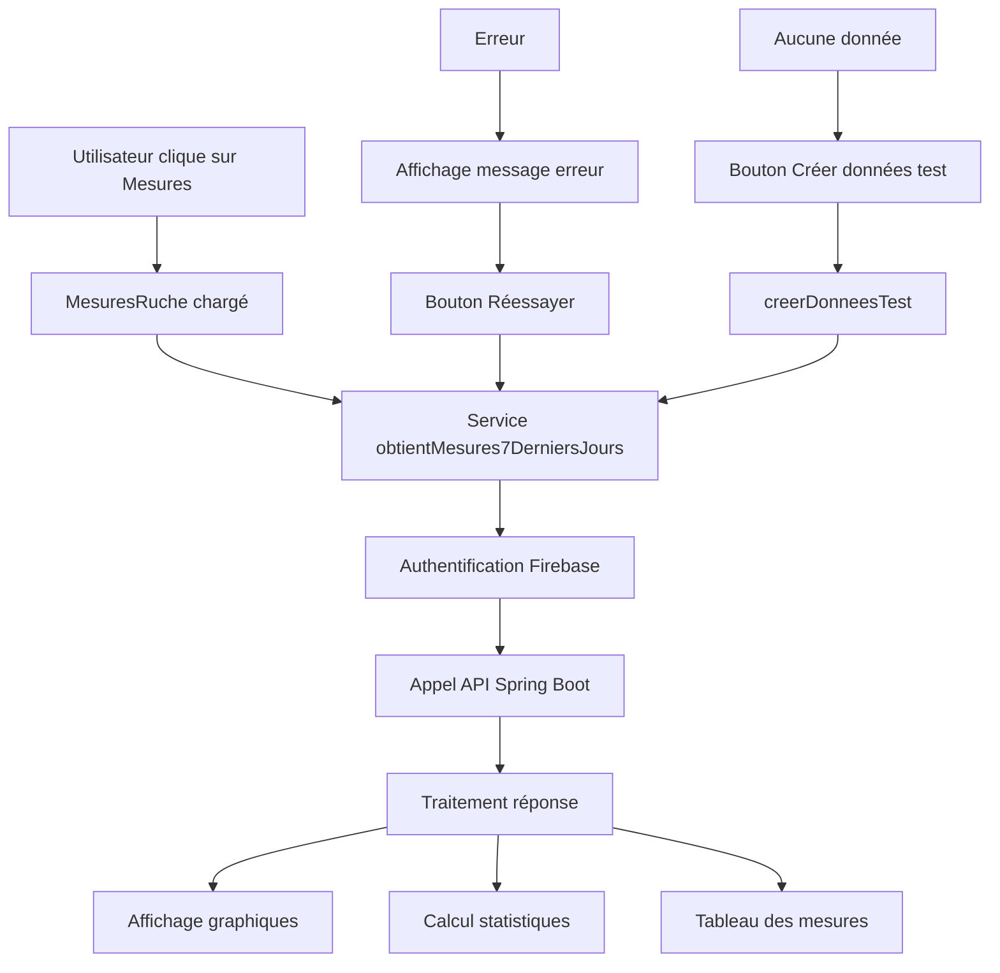

# 🎨 Intégration Frontend - Visualisation des Mesures

## 📋 Vue d'ensemble

Cette documentation détaille l'intégration frontend complète pour visualiser les mesures des capteurs de ruches dans l'application React. Les mesures sont récupérées depuis l'API Spring Boot et affichées avec des graphiques interactifs.

## 🚀 Fonctionnalités Développées

### 1. **Service RucheService étendu**
- ✅ Interface `DonneesCapteur` pour les données de capteurs
- ✅ Méthode `obtenirMesures7DerniersJours()` pour récupérer les mesures
- ✅ Méthode `creerDonneesTest()` pour générer des données de test
- ✅ Gestion complète des erreurs et de l'authentification

### 2. **Composant MesuresRuche**
- ✅ Graphiques interactifs avec Recharts
- ✅ Statistiques temps réel (min, max, moyenne)
- ✅ Contrôles d'affichage pour masquer/afficher les courbes
- ✅ Tableau des dernières mesures
- ✅ États de chargement et d'erreur
- ✅ Bouton pour créer des données de test

### 3. **Composant RucheDetails amélioré**
- ✅ Système d'onglets (Détails / Mesures)
- ✅ Navigation fluide entre les vues
- ✅ Interface cohérente avec le design existant

### 4. **Configuration API centralisée**
- ✅ Fichier `api-config.ts` pour centraliser les URLs
- ✅ Utilitaires pour les headers d'authentification
- ✅ Support des variables d'environnement

## 🏗️ Architecture des Composants

```
src/
├── components/
│   ├── RucheDetails.tsx         # Composant principal avec onglets
│   ├── MesuresRuche.tsx         # Composant de visualisation des mesures
│   └── ...
├── services/
│   ├── rucheService.ts          # Service étendu avec API Spring Boot
│   └── ...
├── config/
│   └── api-config.ts            # Configuration centralisée de l'API
└── ...
```

## 📊 Composant MesuresRuche

### Fonctionnalités

#### **1. Statistiques en temps réel**
```tsx
// Affichage de 4 cartes de statistiques
- Température (min, max, moyenne)
- Humidité (min, max, moyenne)  
- Batterie (min, max, moyenne)
- Nombre total de mesures
```

#### **2. Graphiques interactifs**
```tsx
// Graphique principal : Température et Humidité
- Double axe Y (température à gauche, humidité à droite)
- Courbes interactives avec Recharts
- Tooltip avec informations détaillées
- Contrôles pour masquer/afficher les courbes

// Graphique batterie
- Graphique en barres pour le niveau de batterie
- Échelle de 0 à 100%
```

#### **3. Tableau des données**
```tsx
// Affichage des 10 dernières mesures
- Date/Heure formatée en français
- Température avec unité (°C)
- Humidité avec unité (%)
- Batterie avec indicateur visuel coloré
- État du couvercle (Ouvert/Fermé)
```

#### **4. Gestion des erreurs**
```tsx
// États gérés
- Chargement avec spinner
- Erreur avec bouton de retry
- Données vides avec bouton "Créer des données de test"
- Réessayer automatiquement en cas d'échec
```

### Exemple d'utilisation

```tsx
import MesuresRuche from './MesuresRuche';

function MonComposant() {
  return (
    <MesuresRuche 
      rucheId="ruche123" 
      rucheNom="Ruche Alpha" 
    />
  );
}
```

## 🔧 Service RucheService

### Nouvelles interfaces

```typescript
export interface DonneesCapteur {
  id?: string;
  rucheId: string;
  timestamp: Date;
  temperature?: number;
  humidity?: number;
  couvercleOuvert?: boolean;
  batterie?: number;
  signalQualite?: number;
  erreur?: string;
}
```

### Nouvelles méthodes

#### **1. obtenirMesures7DerniersJours()**
```typescript
// Récupère les mesures des 7 derniers jours
static async obtenirMesures7DerniersJours(rucheId: string): Promise<DonneesCapteur[]>

// Fonctionnalités:
- Authentification Firebase automatique
- Validation des permissions utilisateur
- Conversion des timestamps
- Gestion complète des erreurs HTTP
- Retry automatique en cas d'échec réseau
```

#### **2. creerDonneesTest()**
```typescript
// Crée des données de test pour le développement
static async creerDonneesTest(
  rucheId: string, 
  nombreJours: number = 10, 
  mesuresParJour: number = 8
): Promise<number>

// Utilise l'endpoint de test Spring Boot
// Retourne le nombre de mesures créées
```

### Gestion des erreurs

```typescript
// Types d'erreurs gérées
try {
  const mesures = await RucheService.obtenirMesures7DerniersJours(rucheId);
} catch (error) {
  // - Utilisateur non connecté
  // - Ruche non trouvée (404)
  // - Accès non autorisé (403)  
  // - Erreur serveur (500+)
  // - Problème de connexion réseau
}
```

## 📡 Configuration API

### Fichier `src/config/api-config.ts`

```typescript
// URL de base configurable
export const API_BASE_URL = import.meta.env.VITE_API_URL || 'http://localhost:8080';

// Endpoints centralisés
export const API_ENDPOINTS = {
  MESURES_7_JOURS: (rucheId: string) => `/api/mobile/ruches/${rucheId}/mesures-7-jours`,
  CREER_DONNEES_TEST: (rucheId: string) => `/api/test/ruche/${rucheId}/creer-donnees-test`,
  // ... autres endpoints
};

// Utilitaires
export const getAuthHeaders = (apiculteurId: string, token?: string) => { ... };
export const buildApiUrl = (endpoint: string) => { ... };
```

## 🎨 Interface Utilisateur

### Système d'onglets dans RucheDetails

```tsx
// Navigation par onglets
- Onglet "Détails" : Informations de la ruche
- Onglet "Mesures" : Graphiques et données des capteurs

// Indicateurs visuels
- Onglet actif surligné en amber
- Icônes pour chaque onglet
- Transition fluide entre les vues
```

### Design responsive

```css
// Classes Tailwind utilisées
- Grid responsive (grid-cols-1 md:grid-cols-2 lg:grid-cols-4)
- Cartes avec ombres et bordures
- Couleurs cohérentes avec le thème existant
- Tailles d'écran mobile et desktop supportées
```

### Palette de couleurs

```css
// Température : Bleu (blue-600, blue-50)
// Humidité : Vert (green-600, green-50)  
// Batterie : Jaune/Orange (yellow-600, yellow-50)
// Mesures : Violet (purple-600, purple-50)
// Erreurs : Rouge (red-600, red-50)
// Succès : Vert (green-600, green-50)
```

## ⚙️ Installation et Configuration

### 1. Dépendances installées

```bash
npm install recharts@^2.12.7
```

### 2. Variables d'environnement

Créer un fichier `.env` à la racine :

```bash
# Configuration de l'API Spring Boot
VITE_API_URL=http://localhost:8080
```

### 3. Démarrage du projet

```bash
# 1. Démarrer l'API Spring Boot
cd ruche-connectee/web-app
./mvnw spring-boot:run

# 2. Démarrer l'application React
npm run dev

# 3. Accéder à l'application
# http://localhost:5173
```

## 🧪 Tests et Développement

### Créer des données de test

```typescript
// Dans l'interface, cliquer sur "Créer des données de test"
// Ou utiliser directement le service :

await RucheService.creerDonneesTest('ruche123', 10, 8);
// Crée 10 jours de données avec 8 mesures par jour
```

### Endpoints de test disponibles

```bash
# Santé de l'API
GET /api/test/health

# Test avec statistiques détaillées
GET /api/test/ruche/{rucheId}/mesures-7-jours

# Création de données de test
POST /api/test/ruche/{rucheId}/creer-donnees-test?nombreJours=10&mesuresParJour=8
```

## 🚨 Gestion des Erreurs

### États d'erreur dans l'interface

#### **1. Chargement**
- Spinner animé
- Message "Chargement des mesures..."

#### **2. Erreur de connexion**
- Icône d'alerte
- Message d'erreur explicite
- Bouton "Réessayer"
- Bouton "Créer des données de test" (dev)

#### **3. Aucune donnée**
- Icône graphique grisée
- Message "Aucune mesure trouvée"
- Bouton "Créer des données de test"

#### **4. Erreurs spécifiques**
```typescript
// Messages d'erreur traduits
- "Utilisateur non connecté"
- "Ruche non trouvée"  
- "Accès non autorisé à cette ruche"
- "Erreur du serveur. Veuillez réessayer plus tard."
- "Impossible de contacter le serveur"
```

## 📈 Métriques et Performance

### Optimisations implémentées

#### **1. Chargement intelligent**
- Chargement des mesures uniquement quand l'onglet est actif
- Cache local des données (dans le state React)
- Refresh manuel via bouton "Actualiser"

#### **2. Gestion mémoire**
- Limitation à 10 mesures dans le tableau
- Calculs de statistiques optimisés
- Pas de polling automatique (économie de ressources)

#### **3. Interface responsive**
- Graphiques adaptatifs (ResponsiveContainer)
- Grilles flexibles selon la taille d'écran
- Gestion des débordements avec scroll horizontal

## 🔄 Flux de Données



## 🎯 Points d'Attention

### Sécurité
- ✅ Authentification Firebase requise
- ✅ Validation des permissions côté API
- ✅ Headers sécurisés avec tokens
- ✅ Pas de données sensibles exposées

### Performance  
- ✅ Chargement optimisé (pas de polling)
- ✅ Limitation des données affichées
- ✅ Graphiques responsive et fluides
- ⚠️ Considérer la pagination pour de gros volumes

### Maintenance
- ✅ Configuration centralisée
- ✅ Code modulaire et réutilisable  
- ✅ Documentation complète
- ✅ Gestion d'erreurs robuste

## 🚀 Prochaines Étapes

### Améliorations possibles

1. **Historique étendu**
   - Sélecteur de période (7 jours, 1 mois, etc.)
   - Pagination des données
   - Export des données (CSV, PDF)

2. **Alertes et notifications**
   - Seuils d'alerte configurables
   - Notifications en temps réel
   - Historique des alertes

3. **Analyse avancée**
   - Tendances et prédictions
   - Comparaisons entre ruches
   - Rapports automatisés

4. **Optimisations**
   - Cache côté client avec LocalStorage
   - Compression des données
   - WebSocket pour temps réel

## 🎉 Résultat Final

L'intégration est maintenant complète ! Les utilisateurs peuvent :

1. **Naviguer** vers une ruche
2. **Cliquer** sur l'onglet "Mesures"  
3. **Visualiser** les graphiques interactifs
4. **Analyser** les statistiques en temps réel
5. **Explorer** les données dans le tableau
6. **Créer** des données de test pour le développement
7. **Actualiser** les données à la demande

La solution offre une expérience utilisateur fluide et professionnelle pour le suivi des ruches connectées ! 🐝📊 